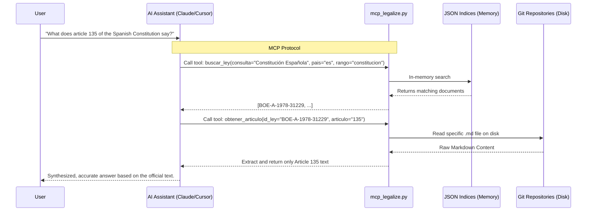

# Legalize MCP Server

**The Model Context Protocol (MCP) Server for the Legalize Ecosystem.**

This repository is a specialized fork of the `legalize` project, designed to act as an MCP Server. It bridges advanced AI Assistants (like Claude Desktop, Cursor, or any MCP-compatible agent) with the consolidated laws of multiple countries in real-time.

By running this server and cloning the country repositories you need, your AI will be able to search laws, extract specific articles, and understand the legal framework of different jurisdictions dynamically.

---

## ✨ Features

- 🌍 **Multi-Jurisdiction Support**: Natively supports any country repository following the [Legalize Format Spec](https://github.com/legalize-dev/legalize-es/blob/main/SPEC.md).
- 🔍 **Advanced Search**: Filter by title, country, sub-jurisdiction, legal rank, status, and date range.
- ⚡ **Dynamic Indexing**: Recursively scans your cloned git repositories and generates fast JSON indices.
- 📖 **Smart Extraction**: Specifically built tools to extract exact articles or sections instead of overwhelming the Context Window.
- 🧪 **Out-of-the-box Testing**: Includes a mock legal repository so you can test the AI integration immediately without downloading gigabytes of data.

---

## 🔄 How it Works (Workflow)

The diagram below shows how the different parts of the ecosystem communicate. The Model Context Protocol ensures your AI has real-time, read-only access to standard offline repos.



---

## 🚀 Setup & Installation

### 1. Clone the Server

```bash
git clone https://github.com/your-username/mcp-legalize.git
cd mcp-legalize
```

### 2. Prepare the Python Environment

```bash
python3 -m venv .venv
source .venv/bin/activate
pip install -r requirements.txt
```

*(Optional)* You can copy `.env.example` to `.env` to configure advanced paths or limits:
```bash
cp .env.example .env
```

---

## 🏛️ Adding Legislation

This MCP server is completely structural: it doesn't contain the actual laws by default (except for testing mocks). You must clone the specific `legalize` countries you want your AI to know about into the `repos/` directory.

All country repositories follow the [Legalize Format Spec](https://github.com/legalize-dev/legalize-es/blob/main/SPEC.md) defined by the original project.

```bash
# Example: Adding Spain and Sweden
git clone https://github.com/legalize-dev/legalize-es repos/legalize-es
git clone https://github.com/legalize-dev/legalize-se repos/legalize-se
```

*Note: The `repos/` folder is ignored by `.gitignore`, so cloning massive datasets inside it will not pollute this repository's git history.*

### Generate the Indices

Once the repositories are downloaded, generate their indices so the MCP Server can search through them efficiently:

```bash
python scripts/update_index.py --repo repos/legalize-es
python scripts/update_index.py --repo repos/legalize-se
```

---

## 🔁 Keeping Indices Up to Date

When upstream country repositories receive updates, you need to re-index them. Use `check_updates.py` to see which repos have new commits that haven't been indexed yet:

```bash
# Check which repos are out of date
python scripts/check_updates.py

# Pull and re-index any outdated repo
git -C repos/legalize-es pull
python scripts/update_index.py --repo repos/legalize-es
```

`check_updates.py` exits with code 1 if any index is stale, making it suitable for use in CI pipelines.

---

## 🔌 Connecting your AI

To use this server, add it to your AI client's MCP configuration settings. Make sure to use **absolute paths**.

### Claude Desktop
Edit `claude_desktop_config.json`:
```json
{
  "mcpServers": {
    "legalize": {
      "command": "/ABSOLUTE/PATH/TO/mcp-legalize/.venv/bin/python",
      "args": [
        "/ABSOLUTE/PATH/TO/mcp-legalize/mcp_legalize.py"
      ]
    }
  }
}
```

### Cursor IDE
1. Go to **Settings** -> **Features** -> **MCP**.
2. Click **+ Add New MCP Server**.
3. **Name**: `Legalize`
4. **Type**: `command`
5. **Command**: `/ABSOLUTE/PATH/TO/mcp-legalize/.venv/bin/python /ABSOLUTE/PATH/TO/mcp-legalize/mcp_legalize.py`

---

## 🛠️ MCP Tools Overview

Once connected, your AI will have access to the following tools:

- `listar_paises` — Lists all currently indexed jurisdictions with document counts and size.
- `buscar_ley` — Searches for laws using filters: title text, country, sub-jurisdiction (e.g. `es-an`), legal rank, status, year, and publication date range.
- `obtener_ley` — Returns the full text and metadata of a specific law by its ID.
- `obtener_articulo` — Extracts a precise slice of text for a specific article. Supports Spanish (`Artículo N`), French (`Article N`), Swedish (`N §`), German and Austrian (`§ N`).
- `listar_rangos` — Lists available norm types and their frequency in the corpus.
- `estadisticas` — Returns global metrics of the loaded datasets.

---

## 📜 Credits & License

Legislative content: public domain (sourced from official government publications).
Repository structure, metadata, and tooling: [MIT](LICENSE).

Original Legalize project created by [Enrique Lopez](https://enriquelopez.eu) · [legalize.dev](https://legalize.dev). 
You can support the original infrastructure by buying a coffee [here](https://buymeacoffee.com/elopcast).

MCP Server capabilities & integration architecture by [jccamel](https://github.com/jccamel).
